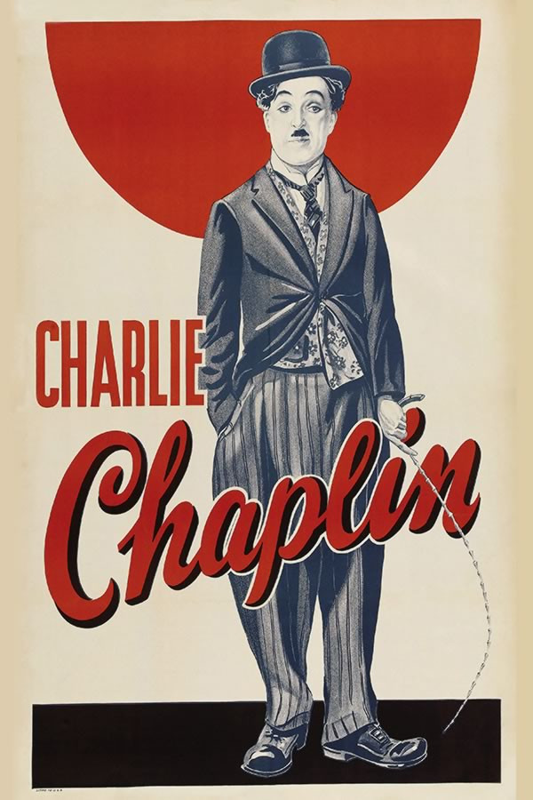
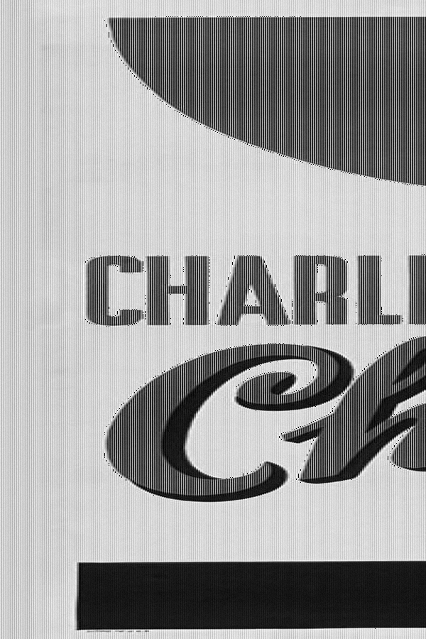
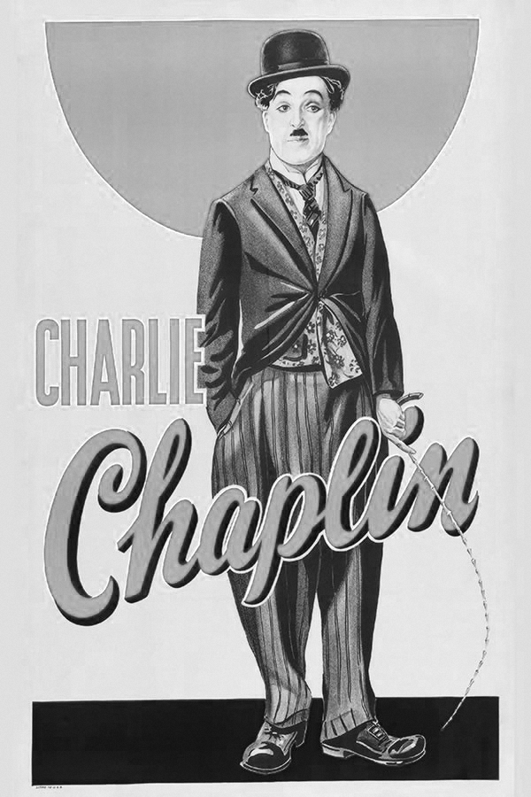
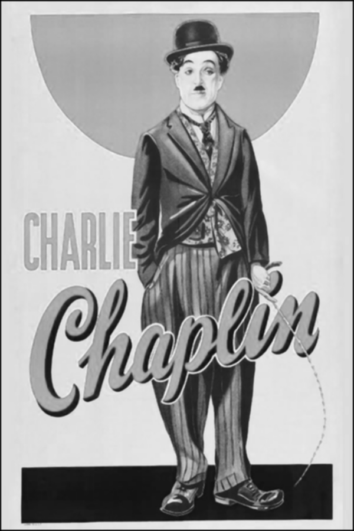
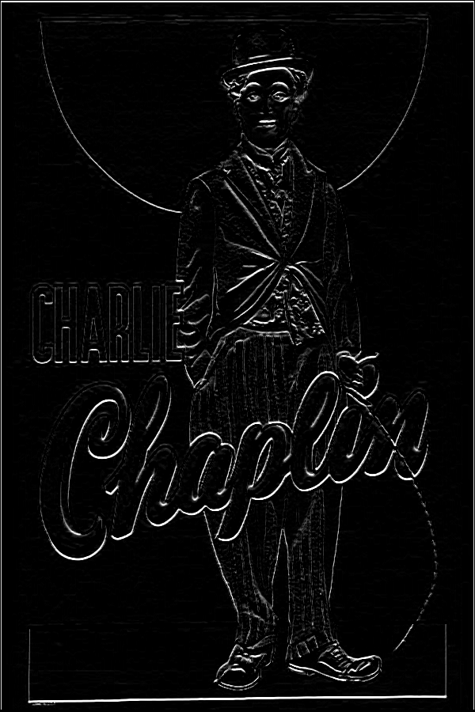
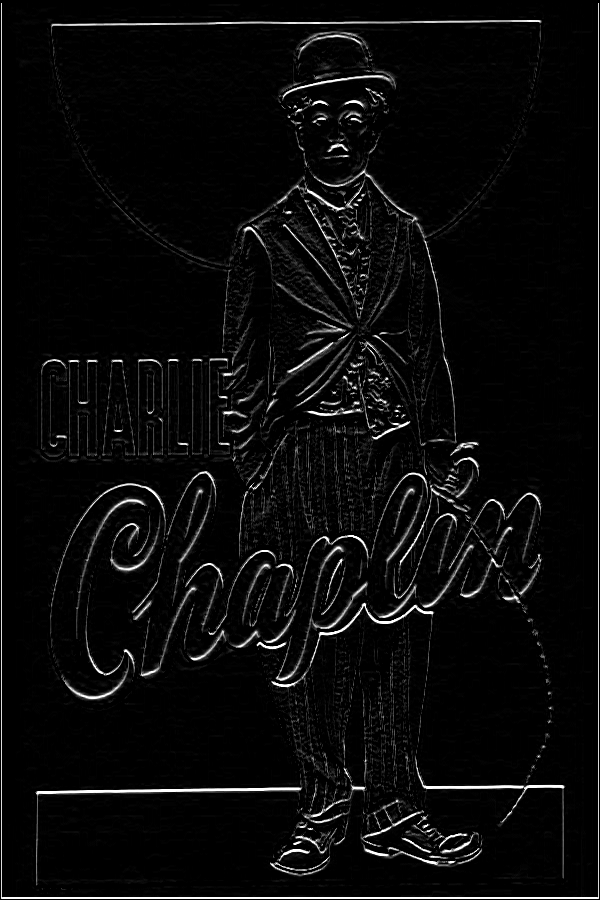
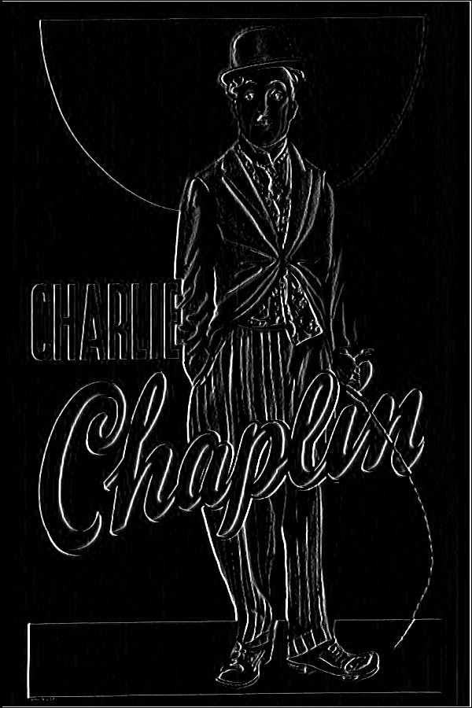
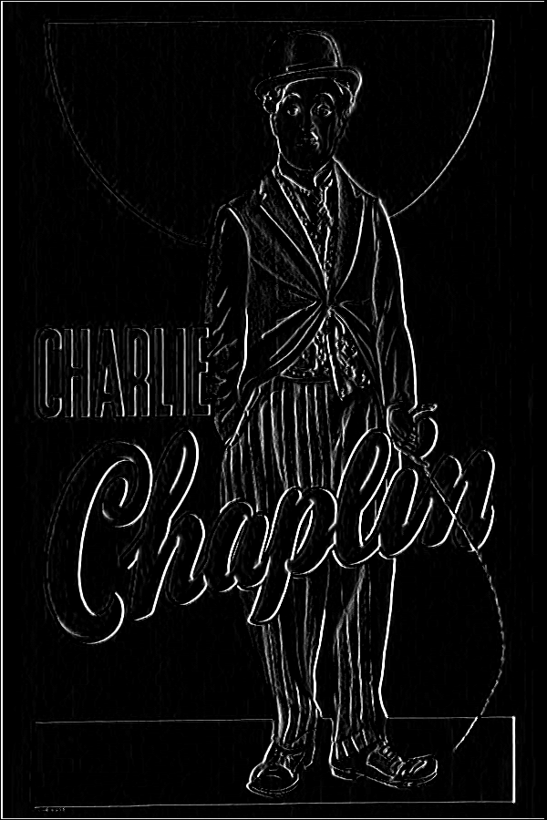

# Processamento Digital de Imagem
## Atividade 3 - Filtros e Ruídos

- Luiz Felipe das Neves Lopes
- Disciplina: Processamento Digital de Imagem
- Professor: Dr. Bruno Bustamante
- Curso: Engenharia da Computação - 4º Ano.
- UNISAL - LORENA - 2020

-------------------------------

### RESULTADOS:

`Conforme a imagem, é recomendado determinado tipo de filtro, para esta imagem o filtro Ruído uniforme preservou detalhes da imagem, sem apresentar efeito de blur/desfoque em comparação com os outros: DWMTM e Passa baixa.`

### Ruído de Gauss

| Antes  |  Depois  |
| ------------------- | ------------------- |
|   |   |

------------------------------------

### Ruído Uniforme

| Antes  |  Depois  |
| ------------------- | ------------------- |
|   |   |

------------------------------------

### Filtro DWMTM

| Antes  |  Depois  |
| ------------------- | ------------------- |
|   |   |

------------------------------------

### Filtro Passa Baixa

| Antes (DWMTM)  |  Depois  |
| ------------------- | ------------------- |
|   |   |

------------------------------------

### Filtro Direcional Norte
| Antes (DWMTM)  |  Depois  |
| ------------------- | ------------------- |
|   |   |

------------------------------------
### Filtro Direcional Sul
| Antes (DWMTM)  |  Depois  |
| ------------------- | ------------------- |
|   |   |

------------------------------------

### Filtro Direcional Leste
| Antes (DWMTM)  |  Depois  |
| ------------------- | ------------------- |
|   |   |

------------------------------------

### Filtro Direcional Oeste
| Antes (DWMTM)  |  Depois  |
| ------------------- | ------------------- |
|   |   |

------------------------------------

